# <a id="Top">Tuya open/close sensor Zigbee with custom firmware</a>

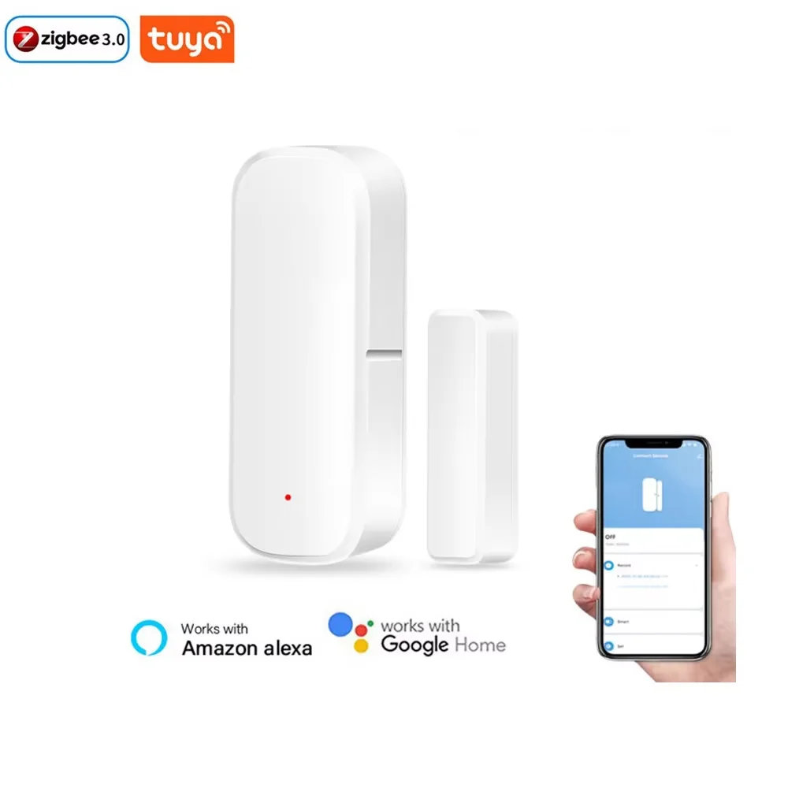

<!--
| Custom Model | Zigbee Model | Z2M Model | Zigbee Manufacturer | Manufacturer | Update method | Photo    |
|:------------:|:------------:|:---------:|:-------------------:|:------------:|:-------------:|:--------:|
| model_1      | TS0203       | TS0203    | Zbeacon             | Tuya         | OTA file      | :camera: |
| model_2      | TS0203       | TS0203    | _TZ3000_hufxidjp    | Tuya         | OTA file      | :camera: |
-->

| Custom Model | Original Zigbee Model | Original Z2M Model | Original Zigbee Manufacturer | Original Manufacturer | Update method | Photo    |
|:------------:|:------------:|:---------:|:-------------------:|:------------:|:-------------:|:--------:|
| model_1 | TS0203 | [TS0203](https://www.zigbee2mqtt.io/devices/TS0203.html) | Zbeacon | [Tuya](https://www.zigbee2mqtt.io/supported-devices/#v=Tuya)         | [OTA file](https://github.com/slacky1965/tuya_door_sensor_ts0203_zed/raw/refs/heads/main/bin/1286-0202-1111114b-tuya_door_sensor_ts0203_zed_model_1.zigbee) | [:camera:](doc/images/device_Zbeacon.jpg) [:camera:](doc/images/device_Zbeacon_short_board.jpg) |
| model_2 | TS0203 | [TS0203](https://www.zigbee2mqtt.io/devices/TS0203.html) | _TZ3000_hufxidjp | [Tuya](https://www.zigbee2mqtt.io/supported-devices/#v=Tuya) | [OTA file](https://github.com/slacky1965/tuya_door_sensor_ts0203_zed/raw/refs/heads/main/bin/1141-d3a3-1111114b-tuya_door_sensor_ts0203_zed_model_2.zigbee) | [:camera:](doc/images/device_TZ3000_hufxidjp.jpg) |
| model_3 | TS0203 | [TS0203](https://www.zigbee2mqtt.io/devices/TS0203.html) | _TZ3000_6zvw8ham _TZ3000_wkfknbzv _TZ3000_n2egfsli    | [Tuya](https://www.zigbee2mqtt.io/supported-devices/#v=Tuya) | [OTA file](https://github.com/slacky1965/tuya_door_sensor_ts0203_zed/raw/refs/heads/main/bin/1141-d3a3-1111114b-tuya_door_sensor_ts0203_zed_model_3.zigbee) | [:camera:](doc/images/device_TZ3000_6zvw8ham.jpg) [:camera:](doc/images/device_TZ3000_wkfknbzv.jpg) |
| model_3 | SNZB-04 | [SNZB-04_eWeLink](https://www.zigbee2mqtt.io/devices/SNZB-04_eWeLink.html) | eWeLink | [eWeLink](https://www.zigbee2mqtt.io/supported-devices/#v=eWeLink) | [OTA file](https://github.com/slacky1965/tuya_door_sensor_ts0203_zed/raw/refs/heads/main/bin/1286-0202-1111114b-tuya_door_sensor_ts0203_zed_model_3.zigbee) | [:camera:](doc/images/device_SNZB-04_eWeLink.jpg) |
| model_4 | ZG-102Z | [ZG-102ZA](https://www.zigbee2mqtt.io/devices/ZG-102ZA.html) | HOBEIAN             | [HOBEIAN](https://www.zigbee2mqtt.io/supported-devices/#v=HOBEIAN) | [BIN file](https://github.com/slacky1965/tuya_door_sensor_ts0203_zed/raw/refs/heads/main/bin/tuya_door_sensor_ts0203_zed_model_4_last_version.bin) | [:camera:](doc/images/device_ZG-102ZA.jpg) |

---

**Автор не несет никакой ответственности, если вы, воспользовавшись этим проектом, превратите свой умный датчик в полоумный.**

Если у вас другая `Zigbee Model`, или другой `Zigbee Manufacturer` или другое исполнение платы, лучше не заливать, не проверив на совпадение GPIO.

Проверялся в zigbee2mqtt.

## Зачем. 

По большому счету из-за биндинга. И вроде все хорошо, и кластеры нужные есть.

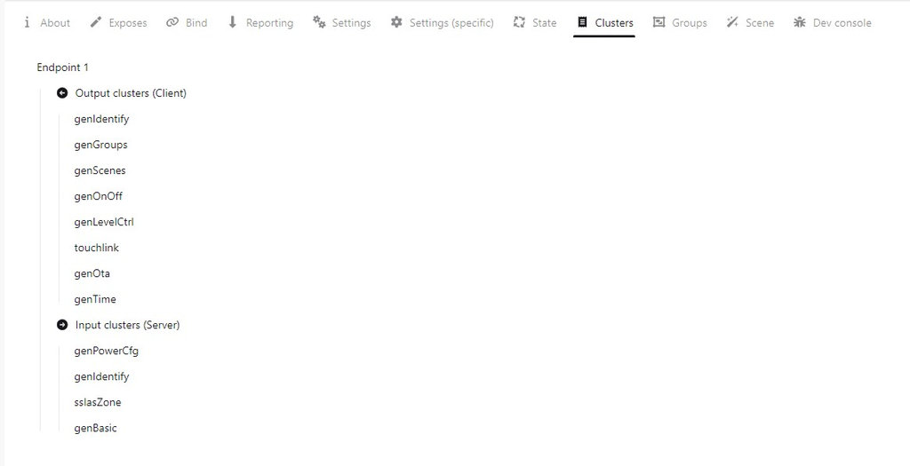

И даже биндится. Но не работает. Так же выяснилось, что эти датчики с группами тоже не дружат.

## Как обновить.

С выходом новой версии `zigbee2mqtt` обновление стало в разы легче. 

Нужно только переключиться в новый интерфейс - `zigbee2mqtt-windfront`.

> [!WARNING]
> Внимание!!! На момент выхода прошивки конвертор не был добавлен в репозиторий `zigbee-herdsman-converters`, поэтому в этой версии `zigbee2mqtt` [внешний конвертор](zigbee2mqtt/ts0203-z-sld.js) нужно положить в директорию `external_converters` и перегрузить `zigbee2mqtt`. В последующих версиях внешний конвертор будет не нужен.

Итак, скачиваем из репозитория нужный файл обновления (какой именно смотрите в таблице вверху). Заходим в устройство. И справа видим в `Firmware version` значок облака. Нам сюда.

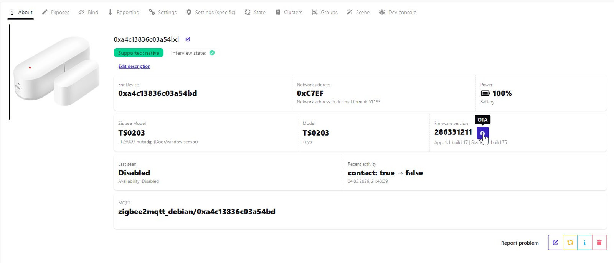

Далее выбираем `Custom firmware` из вываливающегося списка.

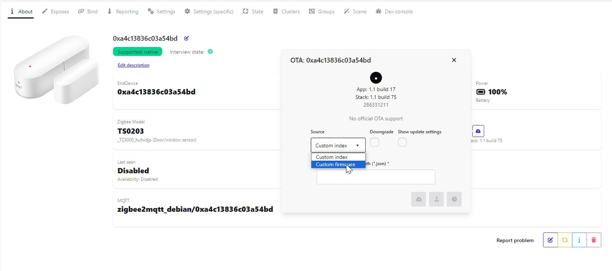

После этого выбираем файл.

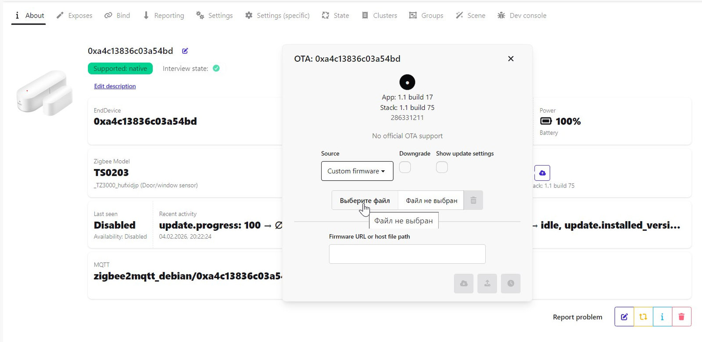

Далее нажимаем кнопку на самом датчике, т.е. будим его и жмем обновить.

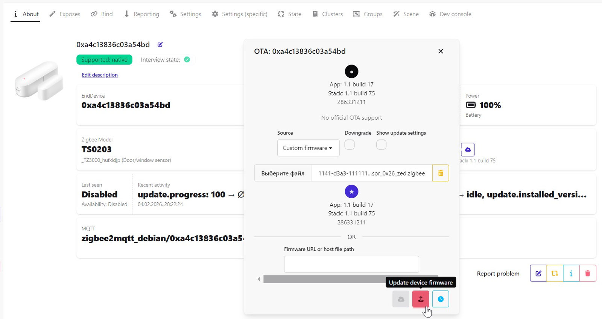

Чтобы понять, пошло обновление или нет, смотрим на изображение датчика, там должен появиться вращающийся кружок со стрелками. И в `Recent activity` будет отображаться оставшееся время в секундах и сколько загрузили в процентах.

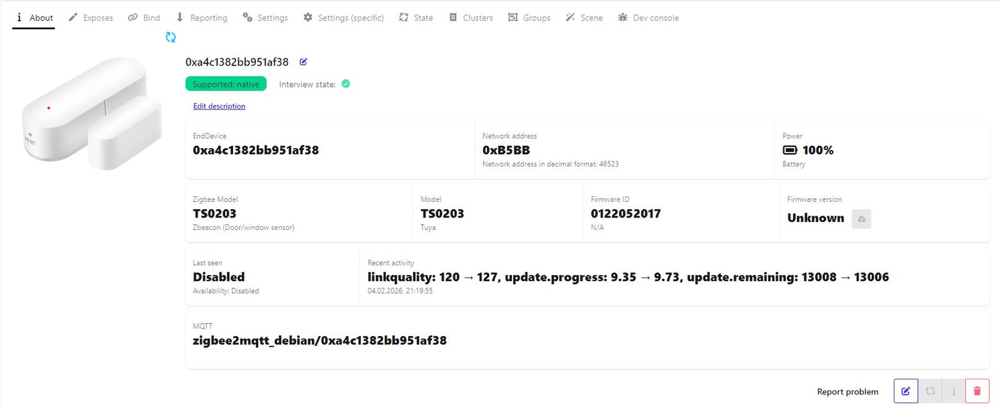

Ну и еще это все будет фиксироваться в логе.

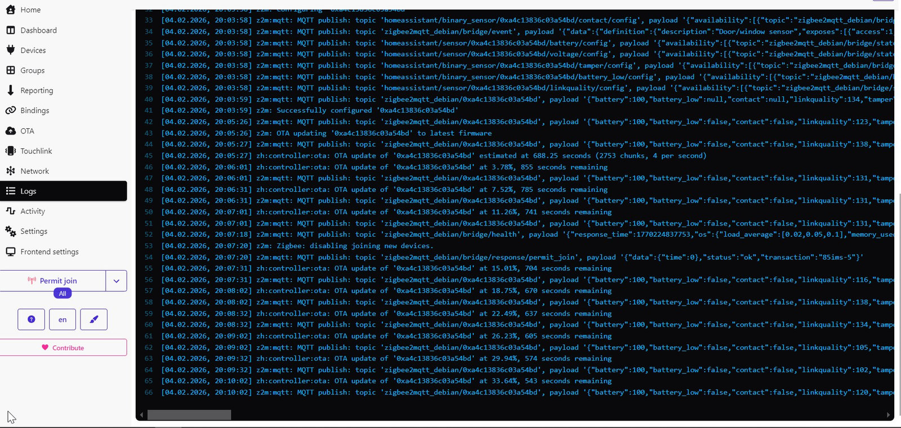

После завершения обновления датчики из `model_2` и `model_3 TS0203` готовы к спариванию, нужно только разрешить это в `zigbee2mqtt`. Старую версию датчика просто удаляем. 

С датчиками из `model_1` и `model_3 SNZB-04` все еще проще. Достаточно по новой пройти `Интервью` и `Конфигурацию`.

---

## Binding

Тут все просто. Идем в устройство, во вкладку `Bind` и добавляем нужную лампочку или выключатель (не все они умеют).

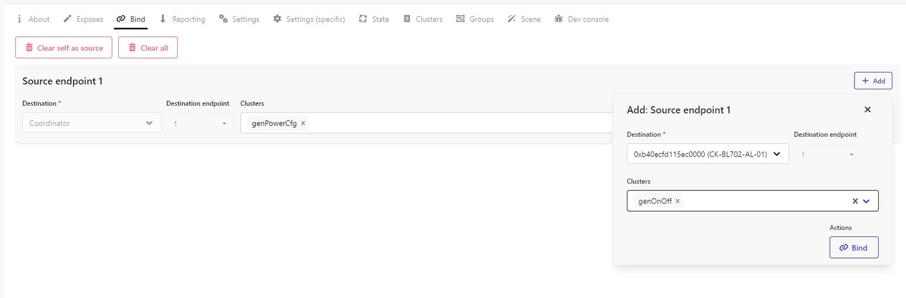

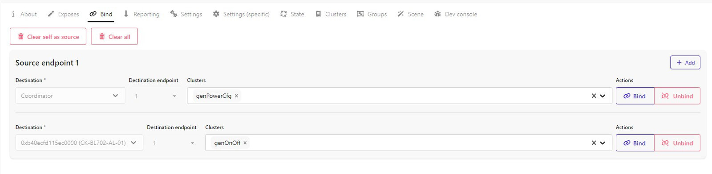

## Groups

Если у вас уже есть какая-то группа с лампочками и вы захотите управлять ими от датчика открытия, то достаточно его просто добавить в эту группу.

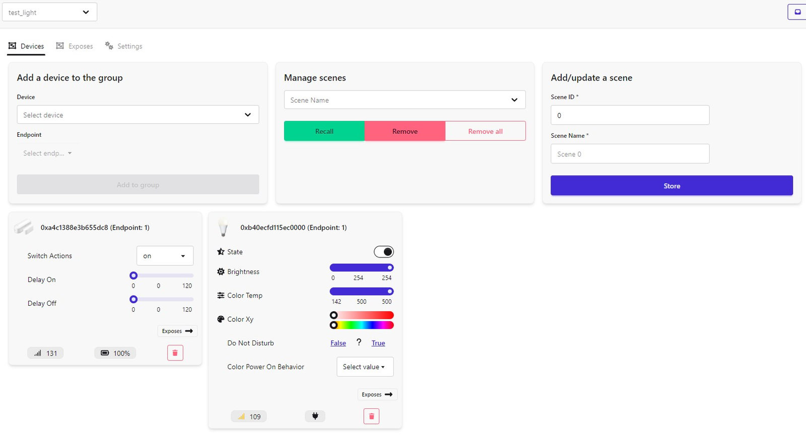

---

## Возможности.

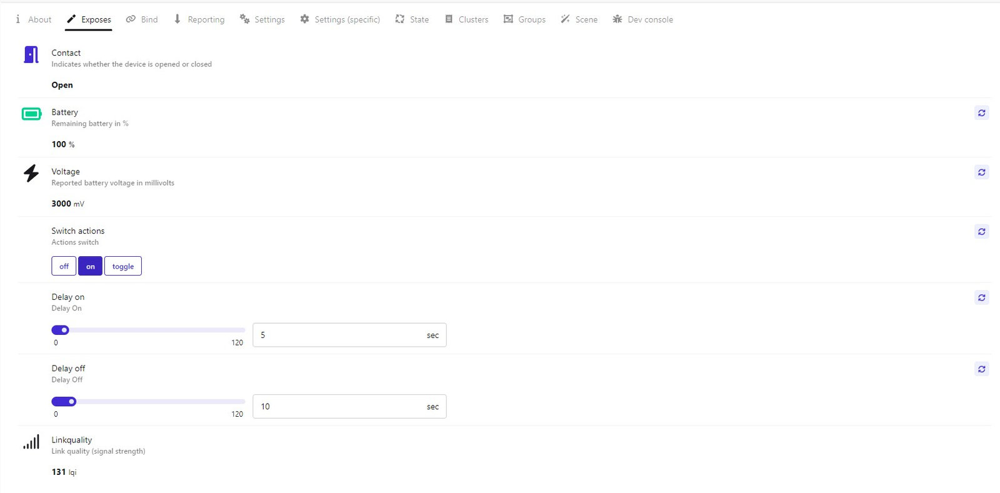

- `Model number` - номер модели из таблицы вверху.
- `Contact` - информирует, открыта дверь/окно или закрыта.
- `Battery` - заряд батарейки в процентах.
- `Voltage` - напряжение батарейки.
- `Switch actions` - какую команду посылать при открытии/закрытии.
- `Delay on` - задержка включения в секундах. От 0 до 120. При значении, равном 0, задержки нет.
- `Delay off` - задержка выключения в секундах. От 0 до 120. При значении, равном 0, задержки нет.
- `On command off` - отключить отправку команды `On`.
- `Off command off` - отключить отправку команды `Off`.
- `Linkquality` - уровень сигнала в попугаях.

---

## Потребление

В дежурном режиме, когда ничего не происходит, средний ток потребления 13-14 мкА.

---

Связаться со мной можно в **[Telegram](https://t.me/slacky1965)**.

### Если захотите отблагодарить автора, то это можно сделать через [ЮMoney](https://yoomoney.ru/to/4100118300223495)

## История версий
- 1.0.01
	- Начало.
- 1.0.02
	- Изменена структура прошивки в области разных датчиков. Теперь она в принципе одна на всё.
	- Добавлены датчики `_TZ3000_6zvw8ham`, `_TZ3000_wkfknbzv`, `_TZ3000_n2egfsli` и `SNZB-04_eWeLink`.
	- Добавлены настройки отключения команд `On` и `Off`.
- 1.0.03
	- Добавлен датчик `Zbeacon` с короткой платой (см. вторую фото в `model_1`).
	- Добавлен датчик `ZG-102ZA HOBEIAN` - `model_4`.
	- Добавлен однократный повтор команд `OnOff`, если ответ на команду не получен в течение 1 секунды.

[Наверх](#Top)

