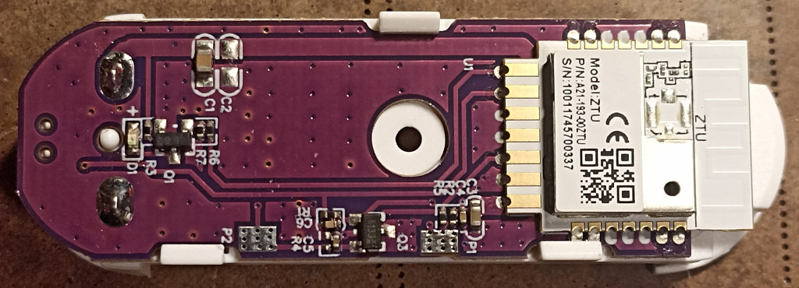

# <a id="Top">Tuya open/close sensor Zigbee with custom firmware</a>

- TS0203 Zbeacon
- TS0203 _TZ3000_hufxidjp 

**Автор не несет никакой ответственности, если вы, воспользовавшись этим проектом, превратите свой умный датчик в полоумный.**

Если у вас другая сигнатура, лучше не заливать, не проверив на совпадение сенсора и GPIO.

Проверялся в zigbee2mqtt.

## Зачем. 

По большому счету из-за биндинга. И вроде все хорошо, и кластеры нужные есть.

И даже биндится. Но не работает. Так же выяснилось, что эти датчики с группами тоже не дружат.

## Как обновить.

С выходом новой версии `zigbee2mqtt` обновление стало в разы легче. 

Нужно только переключиться в новый интерфейс - `zigbee2mqtt-windfront`.

Итак, скачиваем из репозитория нужный файл обновления (какой именно чуть ниже). Заходим в устройство. И справа видим в `Firmware version` значок облака. Нам сюда.

Далее выбираем `Custom firmwware` из вываливающегося списка.

После этого выбираем файл.

---

Для `TS0203 Zbeacon`

выбираем файл [1286-0202-1111114b-tuya_door_sensor_0x20_zed.zigbee](bin/1286-0202-1111114b-tuya_door_sensor_0x20_zed.zigbee).

---

Для `TS0203 _TZ3000_hufxidjp`

выбираем файл [1141-d3a3-1111114b-tuya_door_sensor_0x26_zed.zigbee](bin/1141-d3a3-1111114b-tuya_door_sensor_0x26_zed.zigbee).

---

Далее нажимаем кнопку на самом датчике, т.е. будим его и жмем обновить.

Чтобы понять, пошло обновление или нет, смотрим на изображение датчика, там должен появиться вращающийся кружок со стрелками. И в `Recent activity` будет отображаться оставшееся время в секундах и сколько загрузили в процентах.

Ну и еще это все будет фиксироваться в логе.

После завершения обновления датчик `TS0203 _TZ3000_hufxidjp` готов к спариванию, нужно только разрешить это в `zigbee2mqtt`. Старую версию датчика просто удаляем. 

А вот датчик `TS0203 Zbeacon` придется удалить из `zigbee2mqtt`, перегрузить последний и спарить датчик по новой.

---

## Binding

Тут все просто. Идем в устройство, во вкладку `Bind` и добавляем нужную лампочку или выключатель (не все они умеют).

## Groups

Если у вас уже есть какая-то группа с лампочками и вы захотите управлять ими от датчика открытия, то достаточно его просто добавить в эту группу.

---

## Возможности.

- `Contact` - информирует, открыта дверь/окно или закрыта.
- `Battery` - заряд батарейки в процентах.
- `Voltage` - напряжение батарейки.
- `Switch actions` - какую команду посылать при открытии/закрытии.
- `Delay on` - задержка включения в секундах. От 0 до 120. При значении, равном 0, задержки нет.
- `Delay off` - задержка выключения в секундах. От 0 до 120. При значении, равном 0, задержки нет.
- `Linkquality` - уровень сигнала в попугаях.

---

## Потребление

В дежурном режиме, когда ничего не происходит, средний ток потребления 13-14 мкА.

---

Связаться со мной можно в **[Telegram](https://t.me/slacky1965)**.

### Если захотите отблагодарить автора, то это можно сделать через [ЮMoney](https://yoomoney.ru/to/4100118300223495)

[Наверх](#Top)

